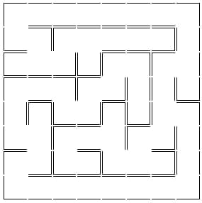

# Intorduction to computer science algorithms
**Codes are written in _Javascript_.**

## Available scripts

In the project directory, you can run:

### `yarn test`

# Data structures list 

## 1. Tree traversals
1. DFS
   - preorder
   - inorder
   - postorder
2. BFS

## 2. Path finding
Finding shortest path between two points in 2D array

## 3. Graphs
Finding the most common job title among networks of people

## 4. Generate maze
Creating curvy and random maze using recursive backtracking algorithm

<table>
  <tr>
    <td width="50%">
      
    </td>
    <td width="60%">
      
    </td>
  </tr>
</table>